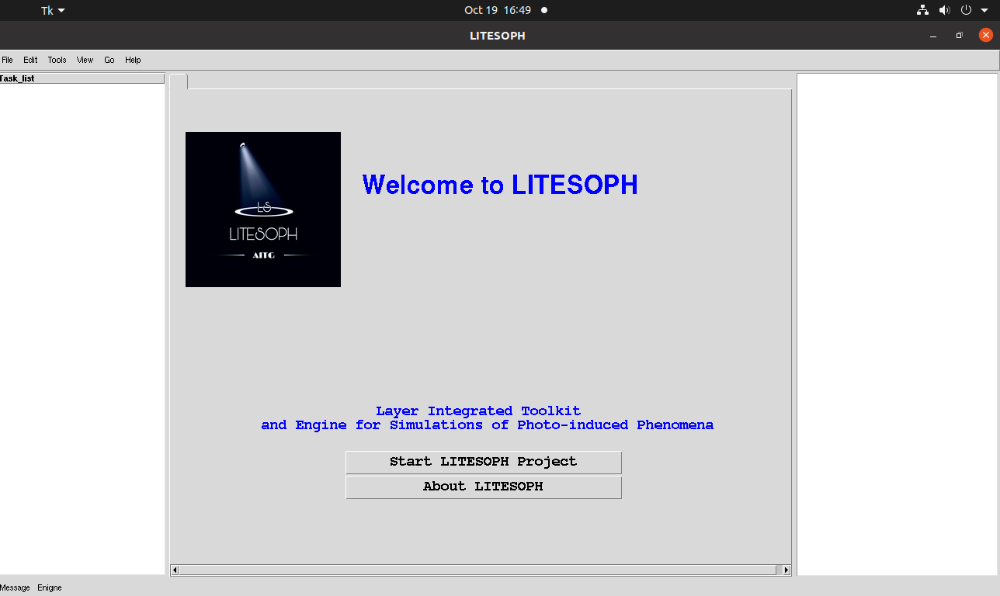

============
Tutorials
============

Welcome to LITESOPH
=====================

We start LITESOPH using the command in :ref:`usage`.

* :ref:`Start LITESOPH Project` : Open the :ref:`LITESOPH-Window` for  the further Calculations.
* About LITESOPH : Click on this button to see "About LITESOPH".

.. toctree::
   :maxdepth: 2

   LITESOPH-Window/LITESOPH-Window
   LITESOPH-Input-Window/LITESOPH-Input-Window
   TDDFT_Calculation/TDDFT_Calculation

examples
==========